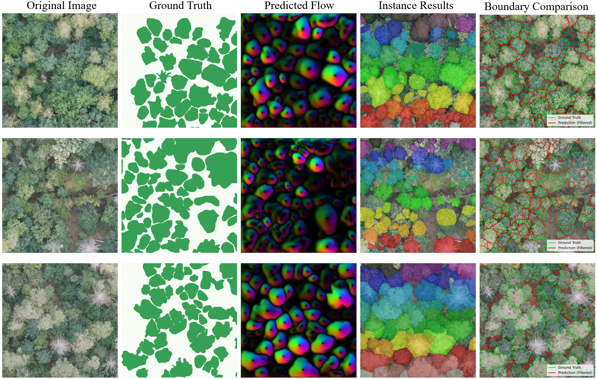
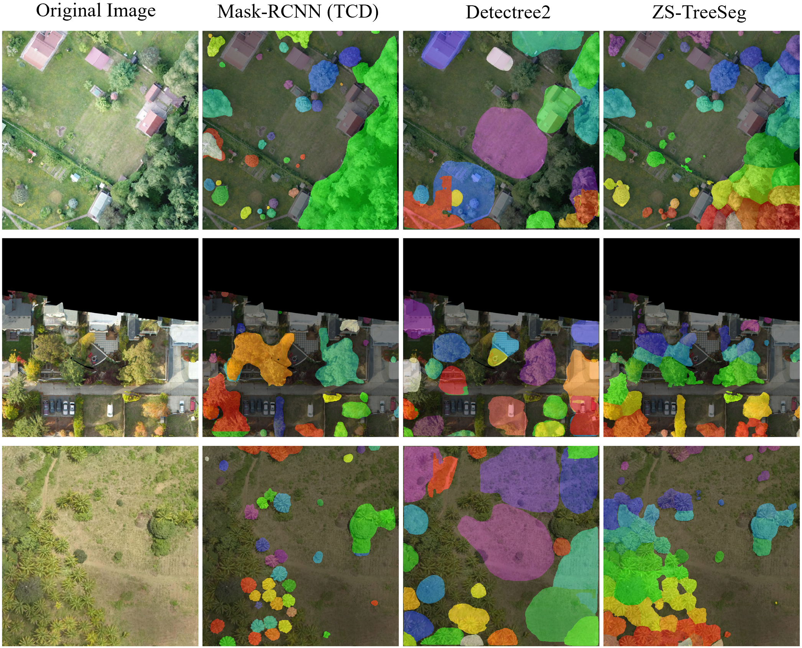

<div align="center">

<p>
  <h1>FG-TreeSeg: Flow-Guided Tree Crown Segmentation without Instance Annotations</h1>
</p>

<p>
  Pengyu Chen<sup>1</sup>, Fangzheng Lyu<sup>2</sup>, Sicheng Wang<sup>1</sup>, Cuizhen Wang<sup>1</sup><br/>
</p>

<p>
  <sup>1</sup>University of South Carolina &nbsp;·&nbsp;
  <sup>2</sup>Virginia Tech
</p>

<!-- Optional badges (edit links later when public) -->
<p>
  
  
  
</p>

</div>

Contact: Pengyuc@email.sc.edu; Paper Link: https://ieeexplore.ieee.org/document/11520829; ArXiv: https://www.arxiv.org/abs/2602.00470

---

## Overview

`zs-treeseg` is a **zero-shot tree crown instance segmentation pipeline** that combines:

1. **Semantic background suppression** using a pretrained SegFormer model, and  
2. **Flow-based instance separation** using Cellpose-SAM.

The core idea is deliberately simple and training-free:

> Instead of training a task-specific instance segmentation model for tree crowns,  
> we reuse a mature semantic segmentation model to suppress background noise and  
> leverage flow-based grouping to separate individual crowns inside canopy regions.

This repository provides a **minimal, fully executable reference implementation**, with the entire pipeline contained directly in the README for clarity and reproducibility.

---

## Method Summary

The pipeline consists of two sequential stages.

### Stage A: Semantic Background Suppression (SegFormer)

A pretrained SegFormer model is used as a *semantic teacher* to generate a binary mask distinguishing **tree canopy vs. background**.  
This step serves as a spatial hard constraint, removing non-canopy textures (e.g., buildings, roads, shadows) that often cause hallucinations in foundation models.

The output is a clean canopy mask that defines the region of interest for instance segmentation.

---

### Stage B: Flow-Guided Instance Segmentation (Cellpose-SAM)

Within the semantic canopy mask:

- Background pixels are removed.
- Fine-grained texture is smoothed to emphasize object-level structure.
- Cellpose-SAM predicts a **diffusion-inspired flow field**.
- Pixels are grouped by **flow convergence to stable sinks**, producing individual tree crown instances.

Instance separation emerges from **flow dynamics rather than explicit boundary detection**, which is particularly effective in dense or overlapping canopies.

---

## Installation

The following dependencies are required:

```bash
pip install -q datasets transformers
pip install -q pycocotools
pip install git+https://www.github.com/mouseland/cellpose.git
```

## Minimal End-to-End Example

### The full zero-shot pipeline is shown below.

```python
import torch
import numpy as np
import cv2
import matplotlib.pyplot as plt
from transformers import SegformerImageProcessor, SegformerForSemanticSegmentation
from cellpose import models
from datasets import load_dataset
from PIL import Image

# --------------------------------------------------
# CONFIGURATION
# --------------------------------------------------

# Semantic segmentation model (teacher)
SEMANTIC_REPO = "restor/tcd-segformer-mit-b5"
TREE_CLASS_ID = 1  # 0 = background, 1 = tree

# Cellpose-SAM model
CELLPOSE_MODEL_TYPE = "vit_h"

use_gpu = torch.cuda.is_available()
device = "cuda" if use_gpu else "cpu"

processor = SegformerImageProcessor.from_pretrained(SEMANTIC_REPO)
semantic_model = SegformerForSemanticSegmentation.from_pretrained(SEMANTIC_REPO).to(device)

cp_model = models.CellposeModel(gpu=use_gpu, model_type=CELLPOSE_MODEL_TYPE)

# --------------------------------------------------
# STAGE A: Semantic Mask
# --------------------------------------------------

def get_semantic_mask(image_pil):
    """
    Generate a binary canopy mask using SegFormer.
    """
    inputs = processor(images=image_pil, return_tensors="pt").to(device)

    with torch.no_grad():
        outputs = semantic_model(**inputs)

    logits = outputs.logits
    upsampled_logits = torch.nn.functional.interpolate(
        logits,
        size=image_pil.size[::-1],
        mode="bilinear",
        align_corners=False,
    )

    pred_seg = upsampled_logits.argmax(dim=1)[0]
    mask = (pred_seg == TREE_CLASS_ID).cpu().numpy().astype(np.uint8)
    return mask

# --------------------------------------------------
# STAGE B: Cellpose-SAM Flow Forcing
# --------------------------------------------------

def run_cellpose_sam_forcing(image_rgb, semantic_mask):
    """
    Force Cellpose-SAM to segment all objects inside the semantic canopy mask.
    """
    # Mask background
    masked_img = image_rgb.copy()
    masked_img[semantic_mask == 0] = 0

    # Light smoothing to suppress leaf-level texture
    masked_img_blurred = cv2.GaussianBlur(masked_img, (3, 3), 0)

    masks, flows, styles = cp_model.eval(
        masked_img_blurred,
        diameter=250,             # approximate average crown diameter (pixels)
        channels=[2, 3],          # vegetation-sensitive channels
        flow_threshold=1,
        cellprob_threshold=-3.0   # force segmentation inside mask
    )

    final_instance_mask = masks * semantic_mask
    return masked_img, final_instance_mask, flows

# --------------------------------------------------
# RUN DEMO ON SAMPLE DATA
# --------------------------------------------------

print("Downloading sample image...")
dataset = load_dataset("restor/tcd", split="train")
sample = dataset[423]

image_pil = sample["image"]
image_np = np.array(image_pil)

print("Stage A: Semantic segmentation")
semantic_mask = get_semantic_mask(image_pil)

print("Stage B: Instance segmentation")
masked_input, instance_mask, flows = run_cellpose_sam_forcing(image_np, semantic_mask)

# --------------------------------------------------
# VISUALIZATION
# --------------------------------------------------

fig, ax = plt.subplots(1, 5, figsize=(30, 6))

ax[0].imshow(image_np)
ax[0].set_title("Original Image")
ax[0].axis("off")

ax[1].imshow(semantic_mask, cmap="gray")
ax[1].set_title("SegFormer Canopy Mask")
ax[1].axis("off")

ax[2].imshow(masked_input)
ax[2].set_title("Masked Input")
ax[2].axis("off")

ax[3].imshow(flows[0])
ax[3].set_title("Predicted Flow Field")
ax[3].axis("off")

ax[4].imshow(image_np)
ax[4].imshow(instance_mask, cmap="nipy_spectral", alpha=0.5)
ax[4].set_title(f"Instance Segmentation\nTrees Detected: {instance_mask.max()}")
ax[4].axis("off")

plt.tight_layout()
plt.show()
```


<h3>Comparison with BAMFOREST Ground Truth</h3>

<div align="center">
  
</div>

<p align="center">
  <i>
  Zero-shot instance segmentation results compared with BAMFOREST ground truth annotations.
  </i>
</p>

<h3>Comparison with Supervised Baselines</h3>

<div align="center">
  
</div>


<p align="center">
  <i>
  Qualitative comparison with supervised baselines (Mask R-CNN and Detectree2).
  </i>
</p>


### Cite
```
@misc{chen2026zstreesegzeroshotframeworktree,
      title={ZS-TreeSeg: A Zero-Shot Framework for Tree Crown Instance Segmentation}, 
      author={Pengyu Chen and Fangzheng Lyu and Sicheng Wang and Cuizhen Wang},
      year={2026},
      eprint={2602.00470},
      archivePrefix={arXiv},
      primaryClass={cs.CV},
      url={https://arxiv.org/abs/2602.00470}, 
}
```
